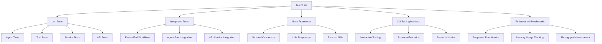
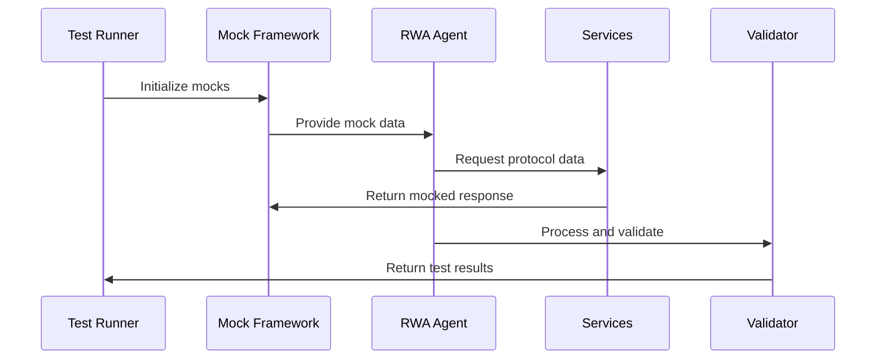

# Design Document

## Overview

The RWA Test Suite Enhancement design focuses on creating a comprehensive testing infrastructure for the SpoonAI RWA yield optimization platform. The design addresses current testing gaps by implementing unit tests, integration tests, mock frameworks, CLI testing tools, and performance benchmarks.

## Architecture

### Testing Architecture Components



### Test Data Flow



## Components and Interfaces

### 1. Enhanced Unit Test Framework

**Test Categories:**
- **Agent Tests**: Validate RWAYieldAgent and PortfolioOptimizerAgent functionality
- **Tool Tests**: Test RWAProtocolDataTool, YieldStandardizationTool, RWAPortfolioAnalysisTool
- **Service Tests**: Validate RWADataAggregator and protocol connectors
- **API Tests**: Test FastAPI endpoints and request/response handling

**Key Interfaces:**
```python
class TestFramework:
    def setup_test_environment(self) -> None
    def teardown_test_environment(self) -> None
    def run_agent_tests(self) -> TestResults
    def run_tool_tests(self) -> TestResults
    def validate_responses(self, response: Any) -> ValidationResult
```

### 2. Mock Framework Implementation

**Mock Components:**
- **Protocol Data Mocks**: Simulate Centrifuge, Goldfinch, Maple API responses
- **LLM Response Mocks**: Provide predictable agent responses for testing
- **External Service Mocks**: Mock Redis, database connections, HTTP clients

**Mock Data Structure:**
```python
@dataclass
class MockProtocolData:
    protocol: str
    apy: float
    tvl: float
    risk_score: float
    pools: List[Dict[str, Any]]
    timestamp: datetime
```

### 3. Integration Test Suite

**Test Scenarios:**
- **Yield Analysis Workflow**: Protocol data → Agent analysis → API response
- **Portfolio Optimization Flow**: User input → Agent processing → Optimization result
- **Data Aggregation Pipeline**: Multiple protocols → Standardization → Caching

**Integration Points:**
```python
class IntegrationTestSuite:
    async def test_yield_analysis_workflow(self) -> None
    async def test_portfolio_optimization_flow(self) -> None
    async def test_data_aggregation_pipeline(self) -> None
    async def test_api_endpoint_integration(self) -> None
```

### 4. CLI Testing Interface

**Interactive Features:**
- Protocol selection and testing
- Agent response validation
- Performance monitoring
- Error diagnosis and reporting

**CLI Commands:**
```bash
python test_rwa_cli.py --test-agent yield-analysis
python test_rwa_cli.py --test-integration --protocol centrifuge
python test_rwa_cli.py --benchmark --duration 60s
python test_rwa_cli.py --validate-setup
```

### 5. Performance Benchmark Suite

**Metrics Tracked:**
- Agent response times
- Memory usage patterns
- API throughput
- Database query performance

**Benchmark Categories:**
```python
class PerformanceBenchmarks:
    def benchmark_agent_response_time(self) -> Metrics
    def benchmark_data_aggregation_speed(self) -> Metrics
    def benchmark_api_throughput(self) -> Metrics
    def benchmark_memory_usage(self) -> Metrics
```

## Data Models

### Test Configuration Model
```python
@dataclass
class TestConfig:
    test_environment: str
    mock_data_path: str
    performance_thresholds: Dict[str, float]
    enabled_test_suites: List[str]
    logging_level: str
```

### Test Result Model
```python
@dataclass
class TestResult:
    test_name: str
    status: str  # "passed", "failed", "skipped"
    execution_time: float
    error_message: Optional[str]
    performance_metrics: Dict[str, Any]
```

### Mock Response Model
```python
@dataclass
class MockResponse:
    protocol: str
    response_type: str
    data: Dict[str, Any]
    latency_simulation: float
    error_simulation: Optional[str]
```

## Error Handling

### Test Error Categories
1. **Setup Errors**: Missing dependencies, configuration issues
2. **Execution Errors**: Test failures, timeout issues
3. **Validation Errors**: Incorrect response formats, missing data
4. **Performance Errors**: Threshold violations, memory leaks

### Error Recovery Strategies
```python
class TestErrorHandler:
    def handle_setup_error(self, error: Exception) -> RecoveryAction
    def handle_execution_error(self, error: Exception) -> RecoveryAction
    def handle_validation_error(self, error: Exception) -> RecoveryAction
    def generate_diagnostic_report(self, errors: List[Exception]) -> Report
```

## Testing Strategy

### Test Pyramid Implementation
1. **Unit Tests (70%)**: Fast, isolated component testing
2. **Integration Tests (20%)**: Component interaction validation
3. **End-to-End Tests (10%)**: Complete workflow verification

### Test Data Management
- **Static Test Data**: Predefined protocol responses and scenarios
- **Dynamic Test Data**: Generated test cases for edge conditions
- **Performance Test Data**: Large datasets for load testing

### Continuous Testing Integration
```python
class ContinuousTestRunner:
    def run_on_code_change(self) -> None
    def run_scheduled_tests(self) -> None
    def generate_test_reports(self) -> None
    def notify_on_failures(self) -> None
```

### Test Environment Configuration
- **Local Development**: Fast feedback with mocked services
- **Staging Environment**: Integration testing with real APIs
- **Performance Environment**: Load testing and benchmarking

## Implementation Phases

### Phase 1: Core Test Infrastructure
- Set up pytest configuration and fixtures
- Implement basic mock framework
- Create unit tests for agents and tools

### Phase 2: Integration Testing
- Develop end-to-end test scenarios
- Implement API integration tests
- Create data flow validation tests

### Phase 3: Advanced Testing Features
- Build CLI testing interface
- Implement performance benchmarking
- Add automated test reporting

### Phase 4: Optimization and Monitoring
- Performance optimization based on benchmarks
- Continuous integration setup
- Test coverage analysis and improvement